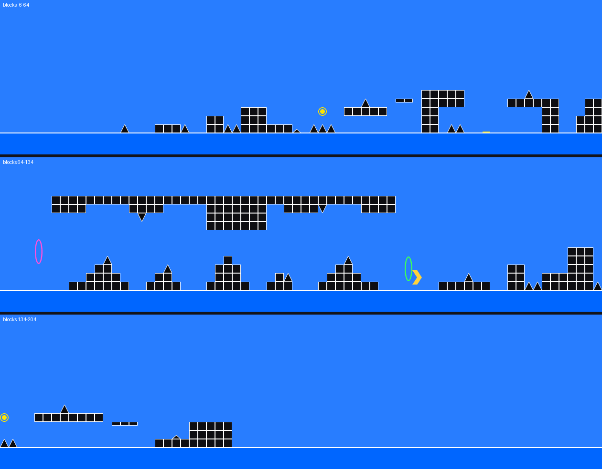
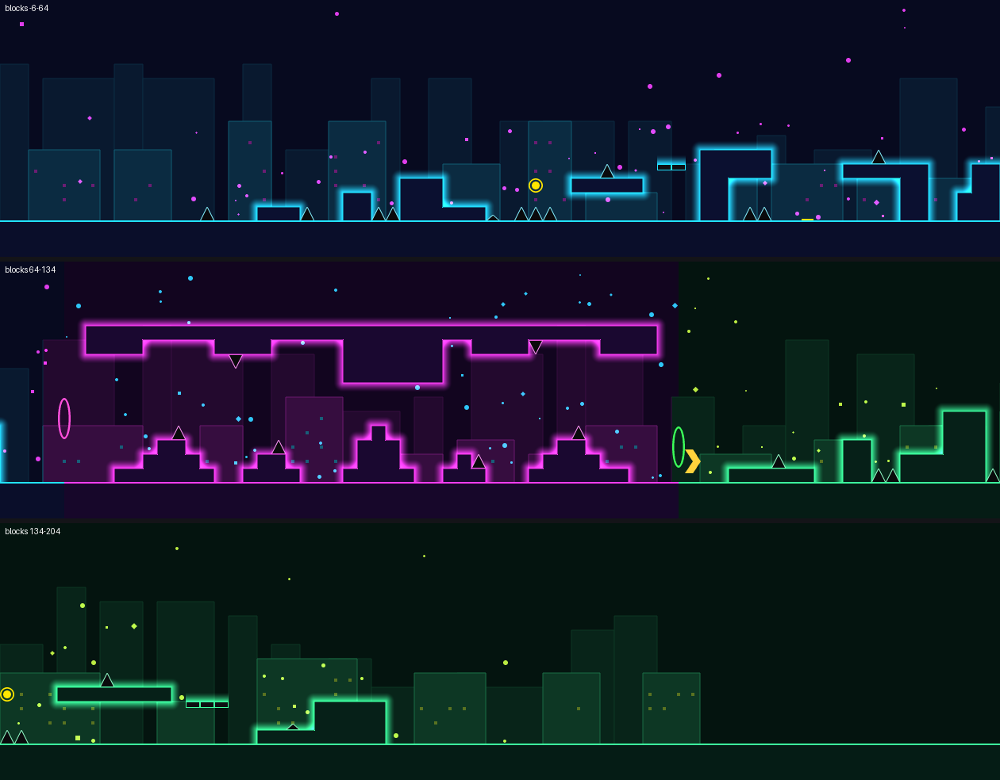
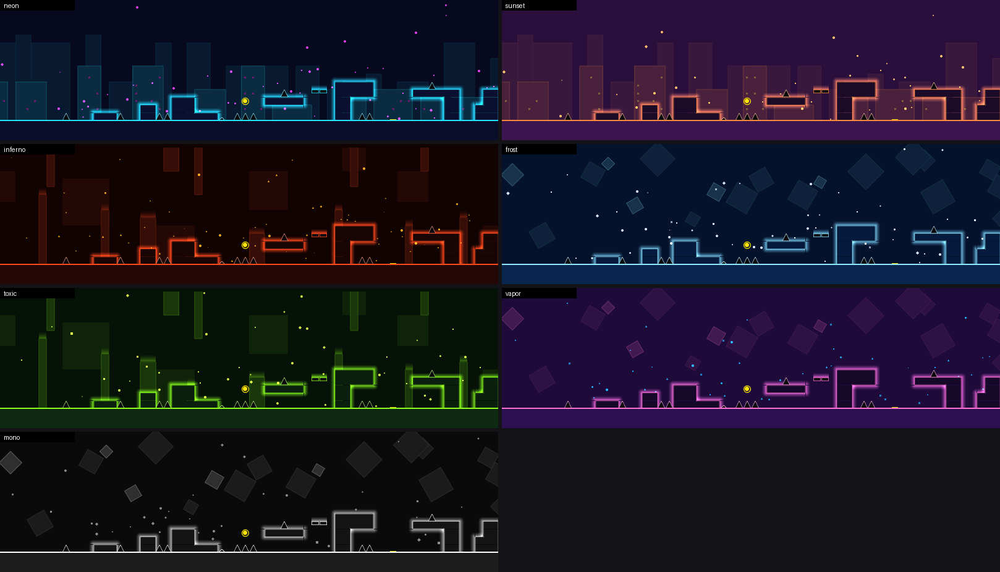

# gd-autodeco

**A Geometry Dash auto-decorator that actually works.** Give it a gameplay layout and it adds
glowing outlines, a background, particles, a color palette per section, and (optionally) pulses
on the beat. You can then open the result in the GD editor.

| Before (layout) | After (`--theme neon --bpm 130`) |
|---|---|
|  |  |



*These previews come from the tool's built-in renderer, which draws simple shapes rather than
the game's sprites, so they are close to the in-game look but not exact.*

## So is the "AI decorates GD levels" video real?

There is no public tool that turns a layout into rate-worthy art at the click of a button, so a
video that shows one is almost certainly staged. Parts of the idea are real, though:

* **Placement is the easy part to automate.** Creators decorate with patterns: outline the
  edges, put glow around structures, add a background, scatter particles, and change colors
  when the gamemode changes. Code can do all of that perfectly and instantly. That is what this
  project does, and it is ordinary procedural generation rather than machine learning.
* **Taste is where AI helps.** Language models are bad at placing thousands of objects at exact
  coordinates, but good at choosing a mood and palette. With `--prompt "haunted castle, toxic
  green fog"`, Claude picks the colors and style for each section and the engine does the
  placement.
* **What it can't do:** hand-drawn art, custom shapes, scenery that matches the level's story,
  or the polish of a featured level. It produces clean, consistent "glow deco". Treat it as a
  strong first pass that you then edit.

## Quick start

```bash
cd gd-autodeco
pip install -e .            # Python 3.10+; add  pip install -e ".[ai]"  for --prompt

python -m gdautodeco sample -o sample.gmd                      # a demo layout
python -m gdautodeco decorate sample.gmd --theme sunset --bpm 128 --preview out.png
# -> sample-decorated.gmd + out.png
```

`examples/sample-decorated.gmd` is ready to import if you only want to see it in-game.

### Getting your level in and out of the game

**Option A: `.gmd` files (recommended, works on every platform).** Install [Geode](https://geode-sdk.org)
and a level import/export mod such as **GDShare**, export your layout as `.gmd`, run
`decorate`, and import the `-decorated.gmd` file.

**Option B: the save file (Windows).** Your editor levels live in
`%LOCALAPPDATA%\GeometryDash\CCLocalLevels.dat`.

```bash
python -m gdautodeco levels  "%LOCALAPPDATA%\GeometryDash\CCLocalLevels.dat"     # list names
python -m gdautodeco decorate "%LOCALAPPDATA%\GeometryDash\CCLocalLevels.dat" --level "My Layout"
```

**Close Geometry Dash first.** The tool adds a *new* level called `My Layout (deco)`, leaves
your original untouched, and writes a timestamped backup of the save file next to it. macOS
saves use different encryption and aren't supported, so use option A there.

## Options

| Flag | What it does |
|---|---|
| `--theme NAME` | `neon` (default), `sunset`, `inferno`, `frost`, `toxic`, `vapor`, `mono` (`themes` lists them) |
| `--prompt "..."` | Describe the look and let Claude choose the palettes and style. Needs `pip install anthropic` and an `ANTHROPIC_API_KEY` |
| `--save-theme f.json` / `--theme-file f.json` | Save a theme (for example one the AI picked) and reuse or hand-edit it |
| `--bpm 128 --first-beat 0.35` | Add glow pulses on every beat. `--first-beat` is the number of seconds from level start to the first beat |
| `--seed N` | Different random background and particles in the same style |
| `--no-background`, `--no-particles`, `--no-structures`, `--no-color-changes` | Turn parts off |
| `--preview out.png --blocks 0:120` | Render a PNG of the result (or just part of it) |

## What it does to your level

1. **Reads the layout.** It finds solid blocks, slabs, slopes, hazards, orbs, and portals on
   the 30-unit grid, and splits the level into sections at gamemode changes (long stretches are
   split too). Each section gets an intensity score from how many hazards and orbs it has.
2. **Structures.** Grid blocks get a flat fill on top (T2). Exposed edges get merged outline
   pieces (T3), with patches in inner corners so outlines close cleanly. Gradient glow goes
   around the outside (B2), with rounded glow on outer corners. Off-grid blocks get an exact
   overlay. Slopes and spikes are recolored to match.
3. **Background.** A two-layer skyline with lit windows (`city`), pillars hanging from top and
   bottom (`pillars`), or floating squares (`geometric`), all on B3/B4 in low-contrast colors.
4. **Particles.** Dots, squares, crosses, and triangles near the action (B1). Busier sections
   get more. All are marked **High Detail**, so Low Detail Mode hides them.
5. **Colors.** 9 free color channels are picked automatically (it never touches channels you
   already use). Each section gets its own palette through color triggers, and blending stays on
   for the glow channels.
6. **Music sync.** With `--bpm`, pulse triggers are placed on each beat. Their x positions
   follow your speed portals. Calm sections pulse every other beat, intense ones pulse the
   outlines and background too.

**Gameplay is never changed.** No gameplay object is moved, removed, or swapped. The only
edits to existing objects are visual: "disable glow" under the new fill, and a theme color on
objects that still use the default color. Objects you already colored are left alone. Every
generated object goes on its own **editor layer** (printed at the end), so you can view it
alone or delete it in one go.

## How I checked it

* Object IDs and sprite offsets come from the community format docs
  ([gddocs](https://github.com/Wyliemaster/gddocs)) and the MIT-licensed
  [GDRWeb](https://github.com/iliasHDZ/GDRWeb) renderer's object tables. The placement
  conventions (where an edge line or glow sits relative to its block, the Z-layer values, how
  2.2 stores scaling) were measured from 12 million objects in 387 rated levels from the public
  [`yusp48/geometry-dash-levels`](https://huggingface.co/datasets/yusp48/geometry-dash-levels) dataset.
* During development, decorated levels were rendered with the real game sprites to confirm
  every glow and outline points the right way. The sprites themselves are not included here.
* The decorator ran on 387 rated levels (up to 413k objects, about 2 s at most) and 34 real
  undecorated layouts from the same dataset. Output re-encodes cleanly and gameplay properties
  are unchanged. One level was refused with a clear message because it already uses every
  color channel. 31 unit tests cover the codec, save files, geometry, and the
  CLI: `pip install -e ".[test]" && pytest`.
* **Not yet done: opening the output in the actual game.** I don't have Geometry Dash where I
  built this. The format, IDs, and placements are all checked against real level data, so it
  should load correctly, but if something looks off in-game, please report it.

## Known limits

* Works best on layouts built from the default blocks. Custom-colored and already-decorated
  objects are left alone, so heavily decorated levels just get busier.
* Uses 2.2 features (separate X/Y scale), so open the result in 2.2 or newer.
* No audio analysis: you supply the BPM.
* It is pattern-based, so every level gets the same kind of look. Use `--seed`, themes, and your
  own edits on top to make it yours.
